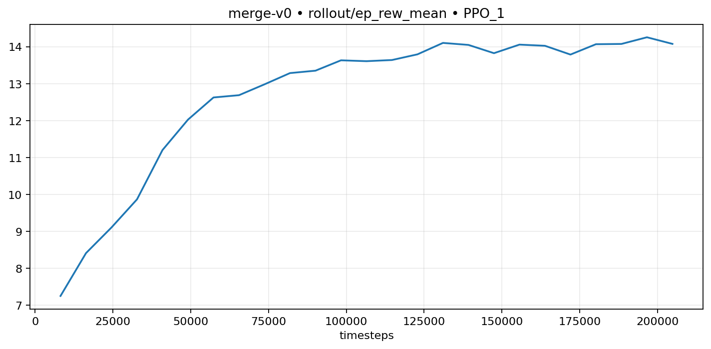
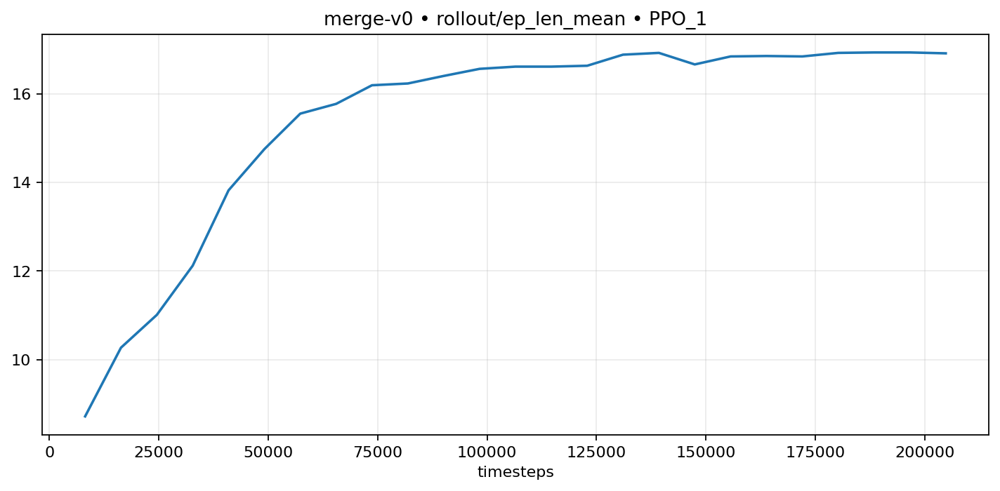
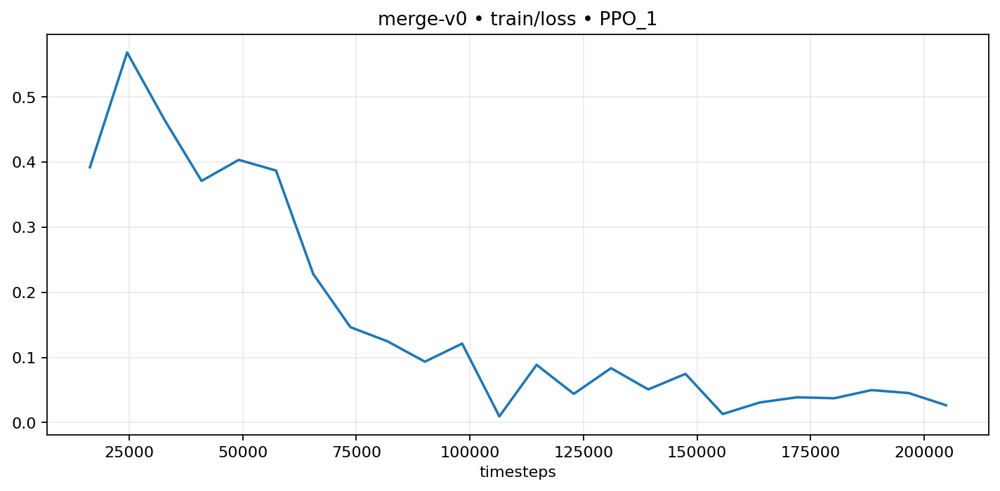

### Reinforcement Learning on `highway-env` (Final Visual Report)

**Author:** Canberk Yalçın  \\
**Date:** Jan 2026  \\
**Repo:** Clean source + visual results (videos + training curves)

---

### Header & Visual Proof (Evolution)

Below is the **3-stage progression** (Untrained → Half-Trained → Fully Trained) as a single evolution artifact per environment.

#### Merge (`merge-v0`) — Evolution (3 stages)

**Embedded GIF (recommended for README):**


**Single combined MP4 (side-by-side, 3 columns):** `assets/videos/merge-v0_evolution.mp4`

#### Other environments — combined MP4 outputs

- **Intersection:** `assets/videos/intersection-v1_evolution.mp4`
- **Parking:** `assets/videos/parking-v0_evolution.mp4`
- **Roundabout:** `assets/videos/roundabout-v0_evolution.mp4`

> If you want **embedded** evolution for each env, convert these MP4s to GIF and embed similarly.

---

### Methodology

#### The Math — Custom Reward Function (Highway example)

From `config/highway.yaml`, the environment reward is shaped by:

\[
R_t = R_{\text{collision}} + R_{\text{speed}} + R_{\text{lane\_change}} + R_{\text{right\_lane}}
\]

With the configured weights:
- **Collision penalty:** \(R_{\text{collision}} = -3.0\)
- **High-speed reward:** \(R_{\text{speed}} = 0.6\) within \(v \in [20, 35]\)
- **Lane-change penalty:** \(R_{\text{lane\_change}} = -0.1\)
- **Right-lane reward:** \(R_{\text{right\_lane}} = 0.0\)

#### The Model — Algorithms, Hyperparameters, Network

This repo trains SB3 agents per scenario via `config/*.yaml` and `src/agents/sb3_manager.py`.

- **Algorithms used**
  - **PPO**: `highway-v0`, `merge-v0`, `roundabout-v0`, `racetrack-v0`
  - **DQN**: `intersection-v1`
  - **SAC (+ HER replay buffer)**: `parking-v0`

- **Example hyperparameters (PPO / Highway)**
  - **learning_rate**: `5e-4` (**linear schedule** in code)
  - **n_steps**: `2048`
  - **batch_size**: `64`
  - **n_epochs**: `10`
  - **gamma**: `0.95`
  - **clip_range**: `0.2`
  - **ent_coef**: `0.01`

- **Neural net architecture**
  - PPO/DQN use SB3 **`MlpPolicy`** (MLP)
  - DQN’s `intersection.yaml` explicitly sets `policy_kwargs.net_arch: [256, 256]`

---

### Training Analysis

#### The Graph — Reward vs Episodes (Merge PPO)



#### The Commentary (Graph Analysis)

- **Early training**: reward is low/unstable because the policy is effectively near-random and collisions/inefficient actions dominate.
- **Mid training**: reward rises as the agent learns stable lane-keeping + merges more consistently (in `merge.yaml`, lane-change is **not** penalized to allow merging).
- **Later training**: the curve stabilizes, suggesting the policy converges and improvements become incremental.

#### Additional labeled curves (Merge PPO)




---

### Challenges & Failures (Narrative)

#### Issue: “Agent keeps changing lanes / unstable driving” (Highway)

- **Symptom**: excessive lane switching (“zig-zag”) increases collision risk and reduces reward consistency.
- **Fix**: introduce a small **lane-change penalty** (`lane_change_reward: -0.1` in `config/highway.yaml`) to discourage unnecessary lane changes while still allowing overtakes.
- **Outcome**: smoother trajectories and more stable reward improvements over training.

---

### Reproducibility (How to run)

```bash
pip install -r requirements.txt

# Train
python3 main.py --env merge --mode train

# Generate 3-stage videos (untrained/half/full)
python3 main.py --env merge --mode visualize

# Combine 3-stage videos into one MP4 per env
python3 scripts/make_evolution_video.py --all

# Export TensorBoard scalars to PNG (for README graphs)
python3 scripts/export_tb_report.py --logdir logs/tensorboard --outdir assets
```

