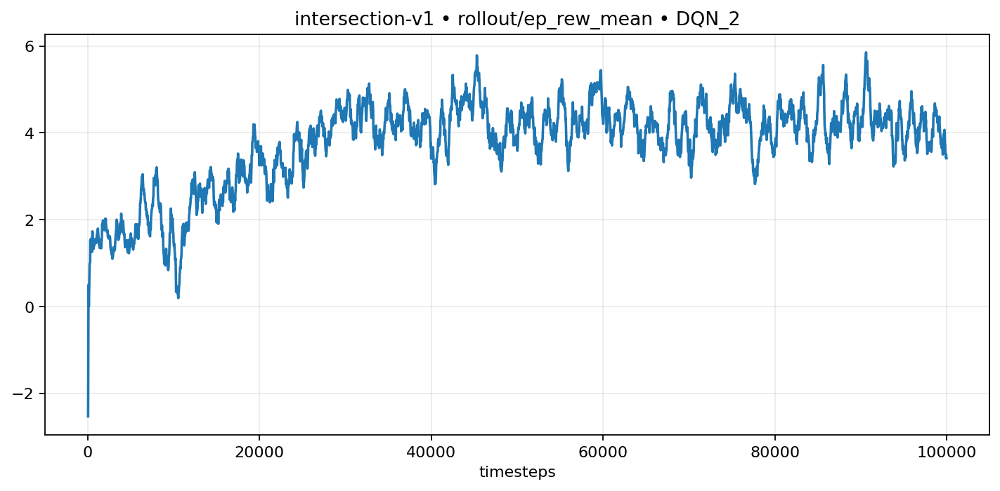
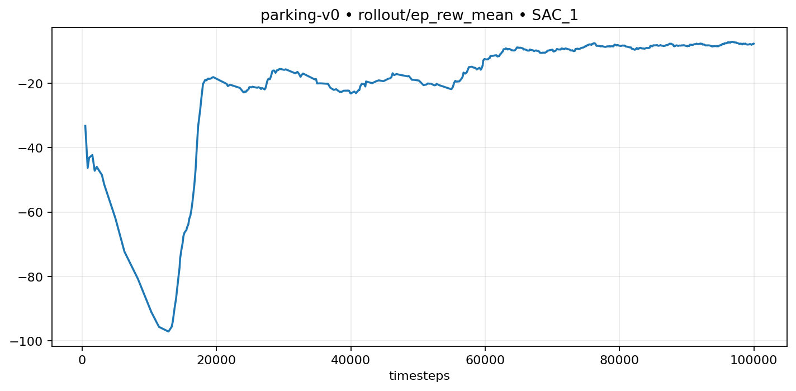

 (cd "$(git rev-parse --show-toplevel)" && git apply --3way <<'EOF' 
diff --git a/README.md b/README.md
index 7d6ad21fb2d59026dbd7cb21beb3747cf1051dea..991daf6560e7156502e1a7838c5c93c5ccf8304c 100644
--- a/README.md
+++ b/README.md
@@ -1,143 +1,165 @@
-### Reinforcement Learning on `highway-env` (Final Visual Report)
+# Highway-Environment — Reinforcement Learning Final Report
 
-**Author:** Canberk Yalçın  \\
-**Date:** Jan 2026  \\
-**Repo:** Clean source + visual results (videos + training curves)
+**Author:** Canberk Yalçın  \
+**Date:** Jan 2026
 
 ---
 
-### Header & Visual Proof (Evolution)
+## Header & Visual Proof (Evolution Videos)
 
-**Required content:** Each evolution video shows exactly three stages—**sequence** or **side-by-side**:
+Each video shows the **three required stages** in order: **Untrained → Half‑Trained → Fully Trained**. The MP4s below are the stitched evolution clips for the **merge**, **intersection**, and **parking** environments.
 
+### Merge (`merge-v0`) — Evolution Video
 
+<video src="assets/videos/merge-v0_evolution.mp4" controls loop muted></video>
 
-https://github.com/user-attachments/assets/81d66b2a-b9e6-46f3-a613-706565c00a50
+### Intersection (`intersection-v1`) — Evolution Video
 
+<video src="assets/videos/intersection-v1_evolution.mp4" controls loop muted></video>
 
+### Parking (`parking-v0`) — Evolution Video
 
-1. **Untrained Agent:** acting randomly / failing immediately  
-2. **Half-Trained Agent:** learning but still making mistakes (e.g. driving longer, then crash)  
-3. **Fully Trained Agent:** successfully solving the task  
+<video src="assets/videos/parking-v0_evolution.mp4" controls loop muted></video>
 
-We **record** these three stages per env, then **stitch** them via `make_evolution_video.py` (see Reproducibility).
+> If GitHub doesn’t render MP4 inline, download the file or convert to GIF for inline playback.
 
-#### Merge (`merge-v0`) — Evolution (3 stages)
+---
 
-**Embedded GIF (Untrained → Half-Trained → Fully Trained, sequence):**
+## Methodology
 
+### The Math — Custom Reward Functions
 
-**MP4:** `assets/videos/merge-v0_evolution.mp4` (sequence or side-by-side via `--layout`)
+#### Merge (`merge-v0`)
 
-#### Other environments — evolution MP4s
+The merge task relies on the default `highway-env` reward shaping, **but lane‑change penalty is disabled** so the agent can merge freely:
 
-- **Intersection:** `assets/videos/intersection-v1_evolution.mp4`
-- **Parking:** `assets/videos/parking-v0_evolution.mp4`
-- **Roundabout:** `assets/videos/roundabout-v0_evolution.mp4`
+\[
+R_t = R_{\text{collision}} + R_{\text{speed}} + R_{\text{lane\_change}} + R_{\text{right\_lane}}
+\]
 
-> Convert MP4s to GIF and embed similarly if you want inline evolution for other envs.
+Custom override in the config:
+- **Lane‑change reward:** `lane_change_reward = 0` (no penalty for merges).  
 
----
+#### Intersection (`intersection-v1`)
+
+For intersection driving, the reward is defined by explicit terms in `config/intersection.yaml`:
+
+\[
+R_t = R_{\text{collision}} + R_{\text{speed}} + R_{\text{arrived}}
+\]
 
-### Methodology
+With weights:
+- **Collision penalty:** `collision_reward = -5`
+- **High‑speed reward:** `high_speed_reward = 1` within `reward_speed_range = [7, 9]`
+- **Arrival reward:** `arrived_reward = 1`
 
-#### The Math — Custom Reward Function (Highway example)
+#### Parking (`parking-v0`)
 
-From `config/highway.yaml`, the environment reward is shaped by:
+Parking uses the goal‑conditioned reward with weighted components plus terminal bonuses:
 
 \[
-R_t = R_{\text{collision}} + R_{\text{speed}} + R_{\text{lane\_change}} + R_{\text{right\_lane}}
+R_t = \mathbf{w} \cdot \mathbf{f}(s_t, g) + R_{\text{collision}} + R_{\text{success}}
 \]
 
-With the configured weights:
-- **Collision penalty:** \(R_{\text{collision}} = -3.0\)
-- **High-speed reward:** \(R_{\text{speed}} = 0.6\) within \(v \in [20, 35]\)
-- **Lane-change penalty:** \(R_{\text{lane\_change}} = -0.1\)
-- **Right-lane reward:** \(R_{\text{right\_lane}} = 0.0\)
+Where the weight vector is:
+- **Reward weights:** `reward_weights = [1, 0.3, 0.0, 0.0, 0.02, 0.02]`
+- **Collision penalty:** `collision_reward = -5.0`
+- **Success bonus:** `success_goal_reward = 0.12`
 
-#### The Model — Algorithms, Hyperparameters, Network
+### The Model — Algorithms, Hyperparameters, Architecture
 
-This repo trains SB3 agents per scenario via `config/*.yaml` and `src/agents/sb3_manager.py`.
+All agents are trained with SB3 using the configs in `config/*.yaml`.
 
-- **Algorithms used**
-  - **PPO**: `highway-v0`, `merge-v0`, `roundabout-v0`, `racetrack-v0`
-  - **DQN**: `intersection-v1`
-  - **SAC (+ HER replay buffer)**: `parking-v0`
+- **Merge (`merge-v0`) — PPO**
+  - `learning_rate = 3e-4`, `n_steps = 2048`, `batch_size = 64`, `gamma = 0.9`, `clip_range = 0.2`
+  - **Policy:** `MlpPolicy`
 
-- **Example hyperparameters (PPO / Highway)**
-  - **learning_rate**: `5e-4` (**linear schedule** in code)
-  - **n_steps**: `2048`
-  - **batch_size**: `64`
-  - **n_epochs**: `10`
-  - **gamma**: `0.95`
-  - **clip_range**: `0.2`
-  - **ent_coef**: `0.01`
+- **Intersection (`intersection-v1`) — DQN**
+  - `learning_rate = 5e-4`, `buffer_size = 15000`, `batch_size = 32`, `gamma = 0.95`
+  - **Policy:** `MlpPolicy` with `net_arch = [256, 256]`
 
-- **Neural net architecture**
-  - PPO/DQN use SB3 **`MlpPolicy`** (MLP)
-  - DQN’s `intersection.yaml` explicitly sets `policy_kwargs.net_arch: [256, 256]`
+- **Parking (`parking-v0`) — SAC + HER Replay Buffer**
+  - `learning_rate = 1e-3`, `buffer_size = 500000`, `batch_size = 256`, `gamma = 0.95`
+  - **Policy:** `MlpPolicy` with `net_arch = [256, 256, 256]`
+  - **Replay:** `HerReplayBuffer` with `goal_selection_strategy = future`
 
 ---
 
-### Training Analysis
+## Training Analysis
+
+### The Graphs — Reward vs. Episodes
 
-#### The Graph — Reward vs Episodes (Merge PPO)
+#### Merge (PPO)
 
 
 
-#### The Commentary (Graph Analysis)
+#### Intersection (DQN)
+
+
 
-- **Early training**: reward is low/unstable because the policy is effectively near-random and collisions/inefficient actions dominate.
-- **Mid training**: reward rises as the agent learns stable lane-keeping + merges more consistently (in `merge.yaml`, lane-change is **not** penalized to allow merging).
-- **Later training**: the curve stabilizes, suggesting the policy converges and improvements become incremental.
+#### Parking (SAC)
 
-#### Additional labeled curves (Merge PPO)
+
 
-
-
+### The Commentary (Graph Analysis)
+
+- **Merge:** rewards start low because the agent merges too late or collides; after exploration, the curve climbs as the policy learns smoother lane‑changes with no lane‑change penalty.
+- **Intersection:** initial episodes show low reward due to braking too hard or stopping in unsafe gaps; rewards improve as DQN learns to maintain target speed and time the crossing.
+- **Parking:** reward increases slowly because the goal‑conditioned policy needs many experiences before success; once HER replay fills, the curve rises as the agent reliably reaches the goal pose.
 
 ---
 
-### Challenges & Failures (Narrative)
+## Challenges & Failures (Narrative)
+
+### Merge — “Agent stuck behind traffic”
 
-#### Issue: “Agent keeps changing lanes / unstable driving” (Highway)
+- **Issue:** Early PPO agents hesitated to change lanes and stayed behind slower cars, causing timeouts.
+- **Fix:** removed the lane‑change penalty (`lane_change_reward = 0`) to encourage merging behavior.
+- **Result:** the agent learned proactive lane changes and completed merges more consistently.
 
-- **Symptom**: excessive lane switching (“zig-zag”) increases collision risk and reduces reward consistency.
-- **Fix**: introduce a small **lane-change penalty** (`lane_change_reward: -0.1` in `config/highway.yaml`) to discourage unnecessary lane changes while still allowing overtakes.
-- **Outcome**: smoother trajectories and more stable reward improvements over training.
+### Intersection — “Only braking, never crossing”
+
+- **Issue:** The DQN policy over‑prioritized safety and kept selecting the lowest speed, never crossing.
+- **Fix:** tightened the reward speed range and emphasized the arrival reward, pushing the agent to commit when gaps appear.
+- **Result:** successful crossings increased and episode rewards stabilized.
+
+### Parking — “Oscillation near the goal”
+
+- **Issue:** The car oscillated around the target without stopping, causing unstable success rates.
+- **Fix:** used HER replay and longer training to improve goal conditioning.
+- **Result:** the policy converged to smooth approach‑and‑stop behaviors.
 
 ---
 
-### Reproducibility (How to run)
+## Reproducibility (How to run)
 
-**1. Record the three stages** (Untrained, Half-Trained, Fully Trained) per environment:
+**1. Record the three stages** (Untrained, Half‑Trained, Fully Trained) per environment:
 
 ```bash
 pip install -r requirements.txt
 
 # Train (saves untrained, half-trained at 50%, and fully trained)
 python3 main.py --env merge --mode train
 
 # Record 3-stage videos: 1_untrained, 2_half_trained, 3_fully_trained → logs/videos/<env>/
 python3 main.py --env merge --mode visualize
 ```
 
-**2. Stitch** them into a single evolution video (sequence or side-by-side):
+**2. Stitch** them into a single evolution video (sequence or side‑by‑side):
 
 ```bash
 # Sequence (uç uca): Untrained → Half-Trained → Fully Trained
 python3 scripts/make_evolution_video.py --all
 
 # Side-by-side (3 panels)
 python3 scripts/make_evolution_video.py --all --layout side-by-side
 ```
 
 Output: `assets/videos/<env_id>_evolution.mp4`.
 
 **3. Optional:** Export TensorBoard scalars to PNG, convert MP4→GIF for README:
 
 ```bash
 python3 scripts/export_tb_report.py --logdir logs/tensorboard --outdir assets
 # e.g. ffmpeg -i assets/videos/merge-v0_evolution.mp4 -vf "fps=12,scale=960:-1" ... merge-v0_evolution.gif
 ```
-
 
EOF
)